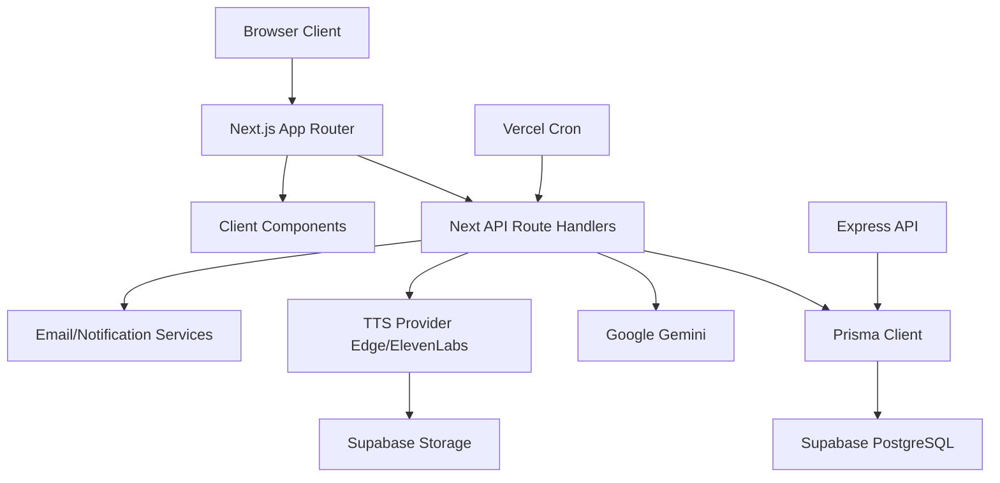

# System Architecture

## 1) Core Stack

| Layer | Technology | Notes |
|---|---|---|
| Frontend + SSR | Next.js App Router (v16), React 18, TypeScript | App routes under `app/**`, mixed server/client components |
| Styling | Tailwind CSS, PostCSS | Utility-first UI with dark-mode class strategy |
| API Layer | Next.js Route Handlers (`app/api/**`) | Primary application API surface |
| Supplemental API | Express + TypeScript (`server/**`) | Legacy/supplementary REST endpoints under `/api/*` |
| ORM | Prisma Client + Prisma Schema | PostgreSQL provider; mapped tables for teacher/admin/gamification domains |
| Database | Supabase PostgreSQL | Runtime URL selection supports pooler and direct URL fallback |
| Auth Provider | Supabase JS (student-side), custom cookies (teacher/admin) | Hybrid auth model |
| AI/LLM | Google GenAI (`@google/genai`) | Gemini model chain with retry + fallback |
| TTS | Provider switch (`edge` or `elevenlabs`), plus Google TTS utility | Current active provider hardcoded to `edge` in `lib/tts-provider.ts` |
| Deployment | Vercel | Cron configured for assignment reminders |

## 2) Service Boundaries

### Web Application Boundary
- Student, teacher, parent, and admin UX routes rendered in Next.js.
- Shared components organized under `components/**`.

### Application API Boundary (Next Route Handlers)
- Domain APIs grouped by prefix:
  - `/api/student/*`
  - `/api/teacher/*`
  - `/api/parent/*`
  - `/api/admin/*`
  - `/api/practice/*`, `/api/assignments/*`, `/api/podcasts/*`, `/api/subjects/*`
- Route handlers coordinate:
  - auth/session checks,
  - Prisma data access,
  - AI/TTS service calls,
  - notification side effects.

### Supplemental API Boundary (Express)
- Runs independently via `npm run dev:api` on `PORT` (default `4000`).
- Exposes supplemental CRUD and status routes.

## 3) Third-Party Integrations

| Integration | Usage | Boundary |
|---|---|---|
| Supabase Auth/JS | Client auth/session interactions for student experience | `lib/supabaseClient.ts`, login/profile flows |
| Supabase PostgreSQL | Primary relational datastore | Prisma datasource (`DATABASE_URL`) |
| Supabase Storage | Audio persistence for TTS output | TTS providers/utilities |
| Google Gemini | Content generation and AI grading workflows | `lib/ai-with-retry.ts`, assignment/practice/podcast flows |
| ElevenLabs / Edge TTS | Podcast and answer audio generation | `lib/tts-provider.ts`, `lib/elevenlabs-tts.ts`, `lib/edge-tts.ts` |
| Vercel Analytics | Frontend telemetry | Root layout analytics include |
| Resend / Email channel | Verification and reminder notifications | `lib/email.ts`, assignment/class routes |

## 4) Routing Topology

### 4.1 App Router Topology (UI)
- Student-facing: `/dashboard`, `/assignments`, `/practice`, `/resources`, `/progress`, `/profile`, `/ai-tutor`
- Parent-facing: `/parent/*`, `/parent-portal`
- Teacher-facing: `/teacher/*` (dashboard, classes, assignments, analytics, students, settings)
- Admin-facing: `/admin/*` (users, credits, progress, financials, content, settings, features)

### 4.2 API Topology
- Core route groups under `app/api`:
  - `admin`, `teacher`, `student`, `parent`
  - `practice`, `assignments`, `podcasts`, `subjects`, `sessions`, `auth`, `cron`, `status`

### 4.3 Middleware Gate Topology
- Root middleware protects selected paths by prefix.
- Cookie guards:
  - Admin: `sa-admin-session`
  - Teacher: `sa-teacher-session`
- Student and parent are primarily local-storage/header/query based identity in API handlers.

## 5) Runtime Interaction Graph

## 6) Key Architectural Characteristics
- Hybrid auth architecture (Supabase + custom role cookies).
- Modular route grouping by user domain and feature area.
- AI-heavy workflows with explicit retry/fallback behavior.
- Gamification as a first-class cross-cutting concern (XP, streaks, badges, leaderboard).
- Deployment-aware DB connection strategy for serverless pooling.
