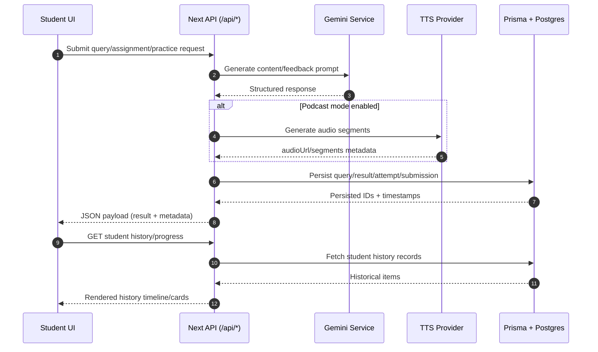
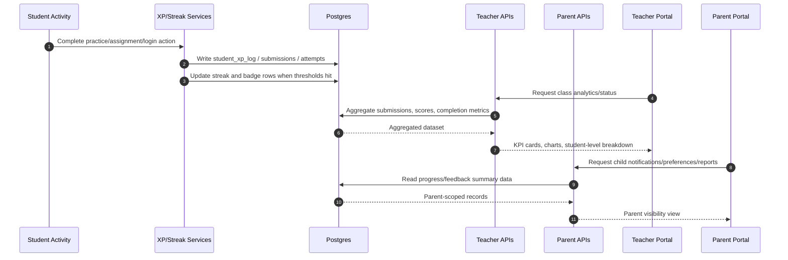

# Data Flow Diagrams

## 1) Student Query -> AI Service -> Persistence -> Student History



## 2) Student Progress -> Analytics Calculation -> Teacher/Parent Portal View



## 3) ASCII Sequence (Compact)

### 3.1 Student Query Pipeline
```text
Student -> /api/assignments|practice|podcasts -> AI/TTS -> Prisma -> Postgres
       <- result payload + IDs + optional audio URLs
Student -> /api/student/research-history|progress -> Prisma -> Postgres -> history/metrics
```

### 3.2 Progress to Teacher/Parent Visibility
```text
Student action -> XP/streak update -> student_xp_log + submissions + attempts
Teacher portal -> /api/teacher/analytics + assignment status -> aggregates -> dashboard
Parent portal  -> /api/parent/* + notifications -> summaries -> parent view
```
